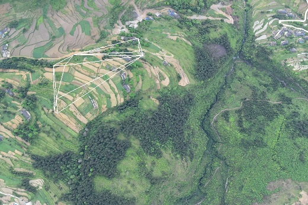

# Delaunay Match

In the algorithm, I will use delaunay triangulation to calculate the degree of similarity
between two key point sets.

# 项目结构

delaunay_match.cpp（项目主函数入口）
_c_triangle_net与_c_triangle（类定义与实现）
_sc_calculator（一些单独的计算函数）

# 编译与运行

## 1 Cmake与编译

这个项目使用C++开发，为了能在不同的系统中都能编译该项目，我使用Cmake来构建该项目。因为，如果你想试着编译该项目并看一看结果，你首先需要安装Cmake。

## 2 编译过程

该项目依赖OpenCV，在编译该项目之前，首先需要安装好OpenCV（目前，代码已兼容OpenCV4.0）。安装好OpenCV之后，可以按照以下过程编译运行该项目。

```
git clone https://github.com/WILeroy/DelaunayMatch.git
cd DelaunayMatch
mkdir build
cd build
cmake ..
make
./DelaunayMatch
```

## 3 运行结果




# 联系方式

Email: wileroy@163.com
